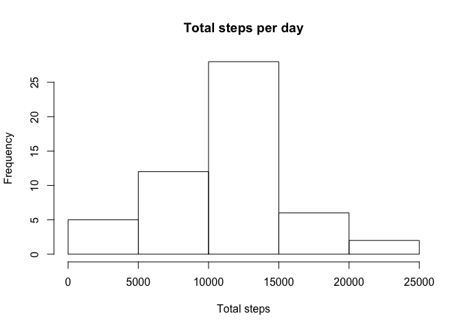
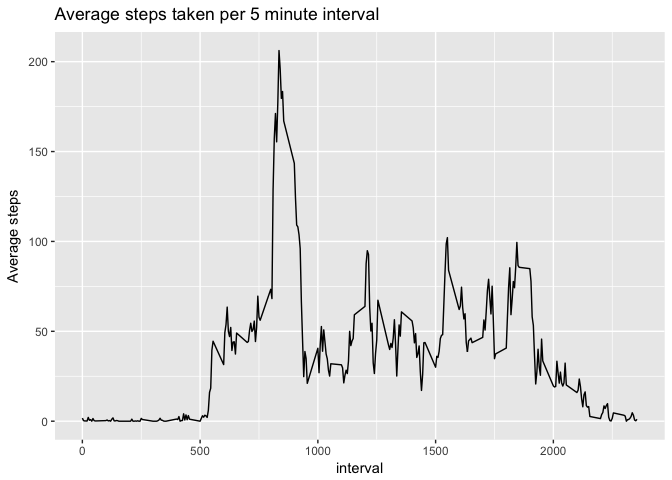
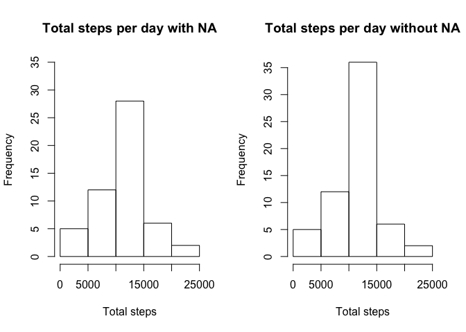
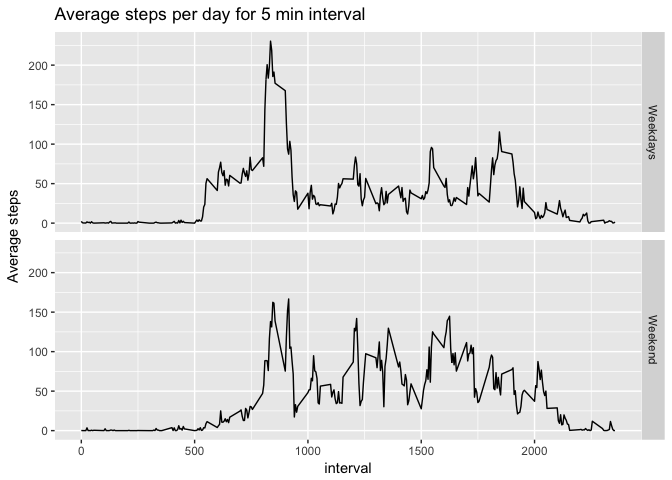

# Reproducible Research: Peer Assessment 1
## Packages needed

```r
library(dplyr)
library(dtplyr)
library(ggplot2)
library(lubridate)
```

## Loading and preprocessing the data
#### Load the data (i.e. 𝚛𝚎𝚊𝚍.𝚌𝚜𝚟())

```r
fileUrl <- "https://d396qusza40orc.cloudfront.net/repdata%2Fdata%2Factivity.zip"
download.file(fileUrl, destfile = "~/RepdataActivity.zip", mode = "wb", quiet = TRUE)
unzip("./RepdataActivity.zip", exdir = "~")
file.remove("~/RepdataActivity.zip")
```
#### Process/transform the data (if necessary) into a format suitable for your analysis

```r
activitydata <- read.csv("~/activity.csv", header = TRUE)
str(activitydata)
```

```
## 'data.frame':	17568 obs. of  3 variables:
##  $ steps   : int  NA NA NA NA NA NA NA NA NA NA ...
##  $ date    : Factor w/ 61 levels "2012-10-01","2012-10-02",..: 1 1 1 1 1 1 1 1 1 1 ...
##  $ interval: int  0 5 10 15 20 25 30 35 40 45 ...
```

## What is mean total number of steps taken per day?
#### Calculate the total number of steps taken per day

```r
library(dplyr)
stepsday <- select(activitydata, steps, date) %>% 
        group_by(date) %>% 
        summarise(sumsteps = sum(steps))
str(stepsday)
```

```
## Classes 'tbl_df', 'tbl' and 'data.frame':	61 obs. of  2 variables:
##  $ date    : Factor w/ 61 levels "2012-10-01","2012-10-02",..: 1 2 3 4 5 6 7 8 9 10 ...
##  $ sumsteps: int  NA 126 11352 12116 13294 15420 11015 NA 12811 9900 ...
```
#### If you do not understand the difference between a histogram and a barplot, research the difference between them. Make a histogram of the total number of steps taken each day

```r
hist(stepsday$sumsteps, 
     main = "Total steps per day", 
     xlab = "Total steps")
```

<!-- -->

#### Calculate and report the mean and median of the total number of steps taken per day

```r
mean(stepsday$sumsteps, na.rm = TRUE)
```

```
## [1] 10766.19
```

```r
median(stepsday$sumsteps, na.rm = TRUE)
```

```
## [1] 10765
```

## What is the average daily activity pattern?
#### Make a time series plot (i.e. 𝚝𝚢𝚙𝚎 = "𝚕") of the 5-minute interval (x-axis) and the average number of steps taken, averaged across all days (y-axis)

```r
library(dplyr)
avesteps <- select(activitydata, interval, steps) %>% 
        group_by(interval) %>% 
        summarise(meansteps = mean(steps, na.rm=TRUE))
str(avesteps)
```

```
## Classes 'tbl_df', 'tbl' and 'data.frame':	288 obs. of  2 variables:
##  $ interval : int  0 5 10 15 20 25 30 35 40 45 ...
##  $ meansteps: num  1.717 0.3396 0.1321 0.1509 0.0755 ...
```

```r
library(ggplot2)
g0 <- ggplot(avesteps, aes(interval, meansteps)) + 
        geom_line() + 
        labs(x = "interval", y = "Average steps", title = "Average steps taken per 5 minute interval")
g0
```

<!-- -->

#### Which 5-minute interval, on average across all the days in the dataset, contains the maximum number of steps?

```r
avesteps[which.max(avesteps$meansteps),]
```

```
## # A tibble: 1 × 2
##   interval meansteps
##      <int>     <dbl>
## 1      835  206.1698
```

## Imputing missing values
Note that there are a number of days/intervals where there are missing values (coded as 𝙽𝙰). The presence of missing days may introduce bias into some calculations or summaries of the data.

#### Calculate and report the total number of missing values in the dataset (i.e. the total number of rows with 𝙽𝙰s)

```r
length(which(is.na(activitydata$steps)))
```

```
## [1] 2304
```

#### Devise a strategy for filling in all of the missing values in the dataset. The strategy does not need to be sophisticated. For example, you could use the mean/median for that day, or the mean for that 5-minute interval, etc.

```r
imputedata <- activitydata
imputedata[is.na(imputedata$steps),]$steps <- avesteps$meansteps
str(imputedata)
```

```
## 'data.frame':	17568 obs. of  3 variables:
##  $ steps   : num  1.717 0.3396 0.1321 0.1509 0.0755 ...
##  $ date    : Factor w/ 61 levels "2012-10-01","2012-10-02",..: 1 1 1 1 1 1 1 1 1 1 ...
##  $ interval: int  0 5 10 15 20 25 30 35 40 45 ...
```

#### Create a new dataset that is equal to the original dataset but with the missing data filled in.

```r
library(dplyr)
imputestepsday <- select(imputedata, steps, date) %>% 
                group_by(date) %>% 
                summarise(sumsteps = sum(steps))
```

#### Make a histogram of the total number of steps taken each day and Calculate and report the mean and median total number of steps taken per day. Do these values differ from the estimates from the first part of the assignment? What is the impact of imputing missing data on the estimates of the total daily number of steps?

```r
par(mfrow = c(1, 2))
hist(stepsday$sumsteps, 
     main = "Total steps per day with NA", 
     xlab = "Total steps",
     ylim = c(0, 35),
     breaks = 5)

hist(imputestepsday$sumsteps,
     main = "Total steps per day without NA",
     xlab = "Total steps")
```

<!-- -->

##### Compare mean with NA and without NA:

```r
mean(stepsday$sumsteps, na.rm = TRUE)
```

```
## [1] 10766.19
```

```r
mean(imputestepsday$sumsteps, na.rm = TRUE)
```

```
## [1] 10766.19
```
##### Compare median with NA and without NA:

```r
median(stepsday$sumsteps, na.rm = TRUE)
```

```
## [1] 10765
```

```r
median(imputestepsday$sumsteps, na.rm = TRUE)
```

```
## [1] 10766.19
```

There is no difference in the mean, but a slight increase in the median. Also the frequency has increased to 35 of the steps range '10.000-15.000'.

## Are there differences in activity patterns between weekdays and weekends?
For this part the 𝚠𝚎𝚎𝚔𝚍𝚊𝚢𝚜() function may be of some help here. Use the dataset with the filled-in missing values for this part.

#### Create a new factor variable in the dataset with two levels – “weekday” and “weekend” indicating whether a given date is a weekday or weekend day.

```r
library(lubridate)
library(dplyr)
imputedata$days <- wday(ymd(imputedata$date), label = TRUE, abbr = FALSE)
weekdays0 <- c("Monday", "Tuesday", "Wednesday", "Thursday", "Friday")

imputedata$weekdays <- factor((imputedata$days %in% weekdays0), 
                              levels = c(TRUE,FALSE),
                              labels = c("Weekdays", "Weekend"))
str(imputedata)
```

```
## 'data.frame':	17568 obs. of  5 variables:
##  $ steps   : num  1.717 0.3396 0.1321 0.1509 0.0755 ...
##  $ date    : Factor w/ 61 levels "2012-10-01","2012-10-02",..: 1 1 1 1 1 1 1 1 1 1 ...
##  $ interval: int  0 5 10 15 20 25 30 35 40 45 ...
##  $ days    : Ord.factor w/ 7 levels "Sunday"<"Monday"<..: 2 2 2 2 2 2 2 2 2 2 ...
##  $ weekdays: Factor w/ 2 levels "Weekdays","Weekend": 1 1 1 1 1 1 1 1 1 1 ...
```

```r
imputedata1 <- select(imputedata, steps, interval, weekdays) %>%
        group_by(interval, weekdays) %>%
        summarise(averagestepsweekdays = mean(steps))
str(imputedata1)
```

```
## Classes 'grouped_df', 'tbl_df', 'tbl' and 'data.frame':	576 obs. of  3 variables:
##  $ interval            : int  0 0 5 5 10 10 15 15 20 20 ...
##  $ weekdays            : Factor w/ 2 levels "Weekdays","Weekend": 1 2 1 2 1 2 1 2 1 2 ...
##  $ averagestepsweekdays: num  2.2512 0.2146 0.4453 0.0425 0.1732 ...
##  - attr(*, "vars")=List of 1
##   ..$ : symbol interval
##  - attr(*, "drop")= logi TRUE
```

#### Make a panel plot containing a time series plot (i.e. 𝚝𝚢𝚙𝚎 = "𝚕") of the 5-minute interval (x-axis) and the average number of steps taken, averaged across all weekday days or weekend days (y-axis). See the README file in the GitHub repository to see an example of what this plot should look like using simulated data.


```r
g1 <- ggplot(imputedata1, aes(interval, averagestepsweekdays)) +
        geom_line() +
        facet_grid(weekdays~.) +
        labs(y = "Average steps", title = "Average steps per day for 5 min interval")
g1
```

<!-- -->


